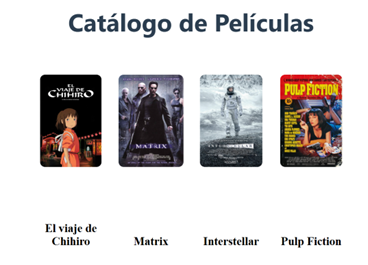
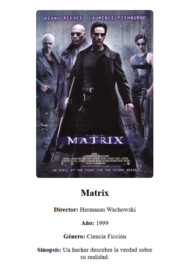

# Plataforma de Streaming en JSON 🎬

Aplicación web simple para mostrar un catálogo de películas, con reseñas de usuarios, usando una base de datos no estructurada en formato JSON.

## Tecnologías usadas
- HTML
- CSS
- JavaScript
- json-server

## Cómo ejecutar

```bash
json-server --watch db.json --port 3000

## Capturas de la aplicación

### Catálogo de Películas


### Detalle de una Película

